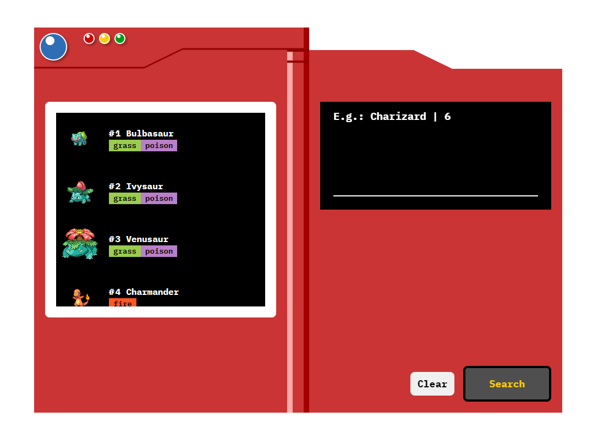

    <h1>Pokedex em VueJs</h1>

  

## Sobre
Aplicação para a visualização de pokémons através de uma interface desenvolvida em VueJs consultando uma API.

## Tecnologias utilizadas
* Vue v2.16.14

## Para executar
1. `git clone https://github.com/davirsreis/VueJs-PokedexAPI.git`
2. `cd VueJs-PokedexAPI`
3. `npm install`
4. `npm run serve`

## Instruções
O usuário inicia a aplicação e aperta sobre a pokedex para abri-la, onde pode navegar pelos pokémons existentes através da rolagem ou consultando pelo nome ou número do pokémon.
